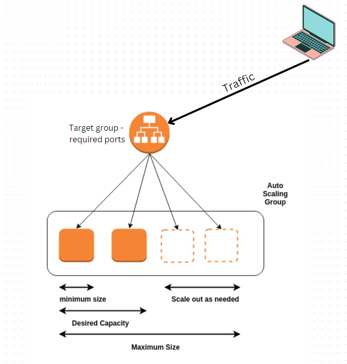

# Autoscaling & Load Balancing

- Autoscaling -  is a cloud computing technique for dynamically allocating computational resources. Depending on the load to a server farm or pool, the number of servers that are active will typically vary automatically as user needs fluctuate.
 
- Load Balancing - is a device that acts as a reverse proxy and distributes network or application traffic across a number of servers. Load balancers are used to increase capacity (concurrent users) and reliability of applications.
 
- Scalability means that an application/system can handle grater loads by adapting - so making the hardware stronger (sclae up) or adding servers (scale out). There are two types: vertical (increase size of instance) and horizontal (increase the number of instances) scaling
 
- Highly available means that you're running you application/systems in at least two servers. It goes hand in hand with horizontal scaling. so if one server is down then you still have the other one.
 
- Elasticity means that once a system is scalable, eleasiticy means there will be some autoscaling so that the system can scale based on the laods.

Auto scaling and load balancing are related because an application typically scales (out) based on load balancing serving capacity. In other words, the serving capacity of the load balancer is one of metrics that shapes the auto scaling policy.

#### For our Instances

- Each instance needs ports 80 and 3000. Need a load balancer that allows aacess at ports 80 and 3000. We need a target group which allows access by port 80 and 3000.
 
- ASG policy - target tracking policy (we want to track the target e.g. 50% or above CPU utilisation - if ec2 instance cpu hits 50% then ASG will spin up another instance).
 
- Target group required ports access
 
- Load balancer - application load balancer (it works at layer 7 of networking which is for HTTP or HTTPs only traffic) which will need multi availability zone information